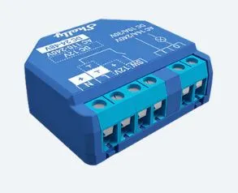
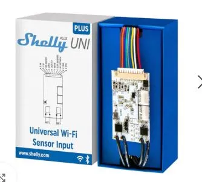
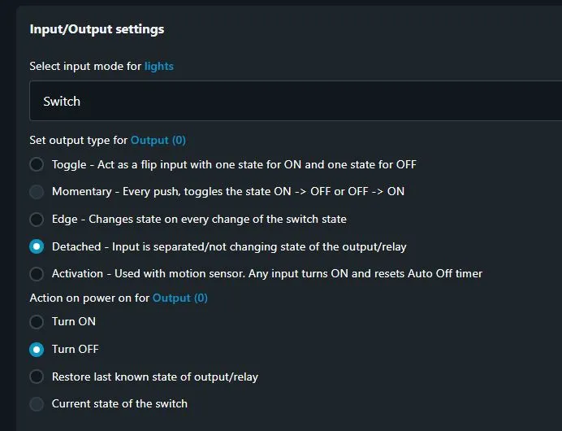
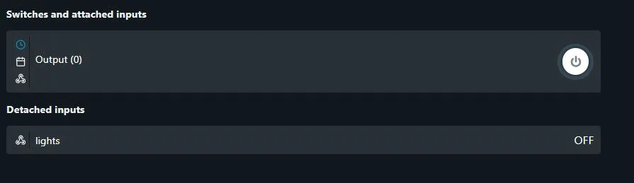
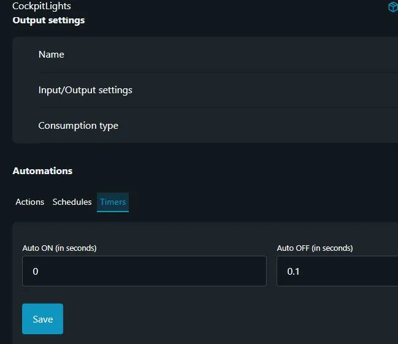
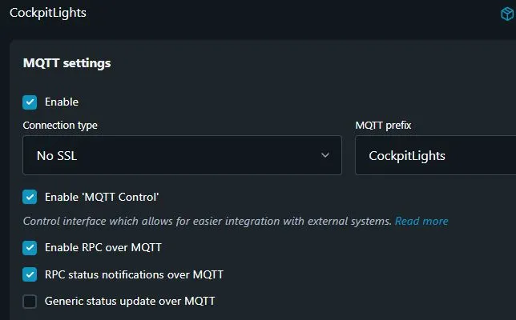
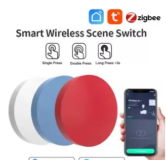
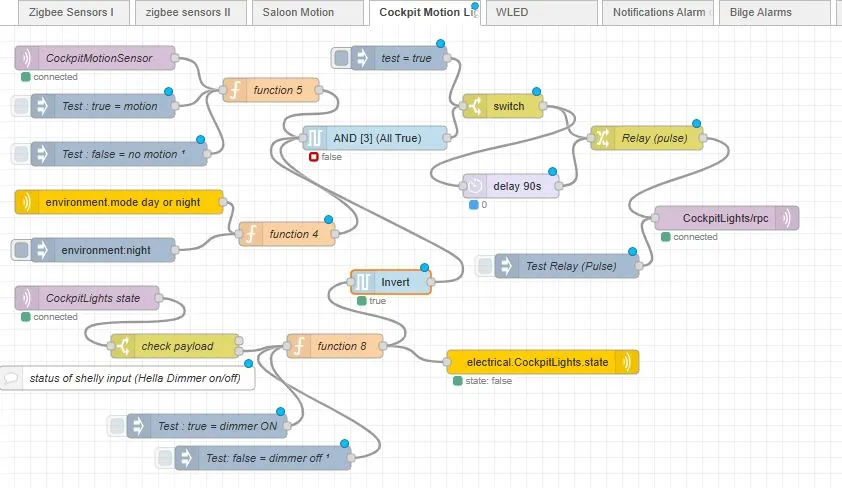
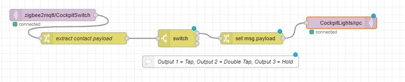

## Background

My boat is fitted with Hella Marine LED dimmer modules, that have wall mounted (hard wired) push button switches for control and dim of overhead LED lights.
The boat builder only fitted a single wall switch, its location is inconvenient at times, so i wanted a second control switch location (without running new wiring throughout the boat); in addition to control by a motion sensor, or any SignalK connected display/control device (eg IPAD).
I wanted to retain the existing (as built) installation & wall control buttons, but add additional control (switches) & automation via SignalK.

To achieve this, I needed a wireless (WiFi) module, that could interface to signalK, have an "input" to sense the current state of the Lights (On/Off) and an output ("momentary pulse") for controlling the Hella dimmer module.
I selected a Shelly 1 Plus module to achieve this.

## Shelly 1 Plus

As my house electrical system is "24VDC", it was important to find a module capable of running directly from the existing light circuit.
Remembering of course that a "24V" system, under battery charging conditions will reach ~29V, which rules out many modules, which have more limited power supply specifications.
I selected the Shelly 1 Plus module, which can operate from 12V/24-48VDC, has a single "switch" input and a relay based "output".

An alternate Shelly module that would deliver dual channel capability (& hence control both Hella 2 module circuits) is the recently released Shelly Uni.

## Interface Circuit

The Shelly 1 Plus is powered from the same lighting circuit as the Hella module.

- Shelly "input" (marked SW)  
terminal is connected to the existing Hella output circuit, and  used to sense the Hella state (On or Off).
- Shelly relay outputs (marked "O" & "I"), connect across the (existing) wall mounted push button switch, to send a "pulse" (creates a momentarily short) across the switch to "control" the Hella module

Note: the Hella module dims the lights using PWM output, however the Shelly ("input") cannot detect the "dim level", only that its "On", likewise the Shelly can only switch the lights On or Off, it does not control Hella dimming.
(in theory it could, however without being able to detect current Dim level, it doesnt make sense to attempt this)  

Even though the Hella "output" to LEDs is "pulse width modulated" (PWM) for dimming operation, the Shelly "input" copes ok with this, and at all available Dim levels, it senses it as "On".

## Configuring Shelly device

The Shelly device needs some configuration, specifically to "unlink" the connection between "input" & "output", which is termed a "detached input" (because the input is  used independently of the output).

The home screen status will then appear as follows;

As the Hella uses a (momentary) Push Button for its control (to toggle state On/Off) the Shelly needs to emulate this by "pulsing" its output. The timer function with switch it off (after 0.1Sec)

I chose to use  MQTT connectivity between the Shelly device &  signalK server (not using a Shelly plugin). Specifically using MQTT RPC ("Remote Procedure Calls") functionality.

## Zigbee Push Button (tap) switches

A zigbee (wireless) button is used for control purposes, each button can have three actions, namely "tap", "hold" and "double tap".
Utilising a NodeRed flow, this toggles the light On/Off via a short "tap".
For a detailed tutorial on integrating zigbee wireless devices into signalK,
see this **** tutorial.

## Zigbee Motion Sensors

A motion sensor in the outdoor cockpit area provides JSON data via MQTT that is used within a NodeRed flow to switch the lights on for a period of time, subject to selected conditions being met.

## NodeRed Flow for Motion Automation

This Nodered flow for "motion" control of the lights has a number of "inputs" for decision making:

- CockpitMotionSensor (MQTT IN Node)
used to receive the status of zigbee motion sensor
- environment.mode day or night (SK subscribe Node)  
that is populated by the "signalK-derived-data" plugin
(so the AND output can only be True if its night)
- CockpitLights state (MQTT IN Node)  
which is the state reported by Shelly "Input" (SW pin); if its True (the lights are On, which is then inverted before input to AND gate), so it will only trigger if the lights are Off.

The output of the AND gate is only True, (ALL True) if Motion is detected, And its Night, And the Lights are currently Off. The delay 90S Node initiates a further pulse, switching the lights off after 90S.

- electrical.CockpitLights.state  
(SK send pathvalue node)  
is used to set a path (so that lights state can be displayed)
- CockpitLights/rpc (MQTT Out Node)  
 sends an "Output" message "ON" to Shelly, which then pulses its output for 0.1 second (simulating tapping the push button switch)

## NodeRed Flow for Zigbee Tap Button

- zigbee2mqtt/CockpitSwitch (MQTT IN Node)  
recieves the button action (eg Tap)
- extract contact payload (from JSON)
- switch  
(has 3 outputs, namely for Tap, double Tap and Hold actions)
- set msg.payload
formats the msg.payload for the MQTT RPC message

## Summary

I was able to retain the existing Hella Marine dimmer modules and wall switch buttons; and with the addition of a shelly module, a zigbee wireless motion detector & zigbee wall button integrated into signalK; signifigantly extend its functionality, introducing a level of intelligent "boat automation" for motion control of these lights.
