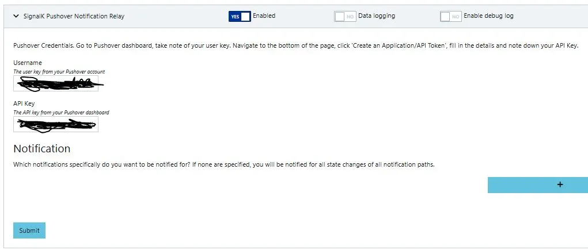
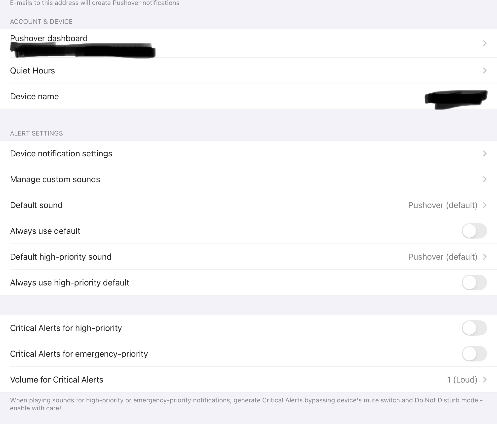
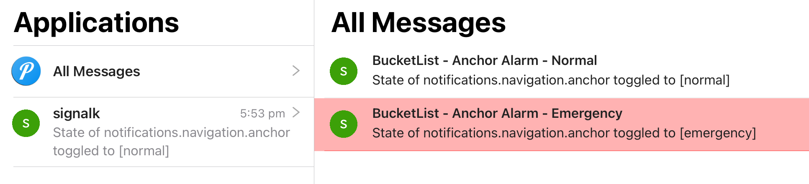
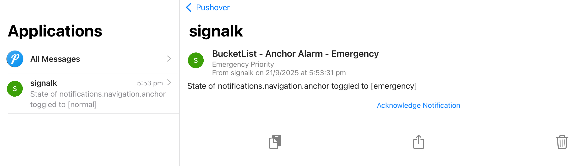
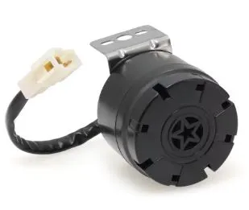
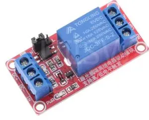
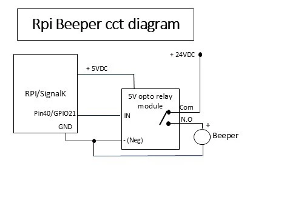
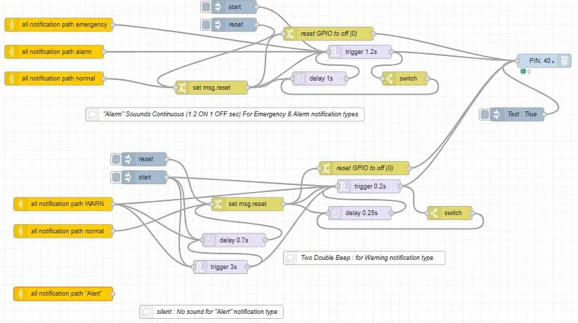

## Background

With extensive monitoring capabilities built into my signalK system, I wanted a method to provide "remote" notifications/alarms of selected events, so that when remote from the boat.. even on the other side of the world traveling, I could receive alerts on my Android phone & Ipad (IOS), thus demanding a common method across both mobile device operating systems.
SignalK has a built in "notification engine" that requires a display device, or application/plugin to handle these, and in turn trigger audible & visual alerts.
There are two basic use cases, namely "Locally" (on the boat) or "Remote" (which could be "at the beach", or "on the other side of the world").  
This list is certainly not exhaustive, just based on my experience.

**Local Alerts**:

- audible alerts from sound devices such as USB speakers, audio output (from RPi) to a local stereo (eg Fusion)
- audible alert beeper/buzzer/siren device (eg driven by RPi GPIO)
- Displays devices such as MFDs, monitor/touchscreen
- Tablet/phones or PCs running applications (eg WilhelmSK, KIP, OpenCPN)
- 
**Remote Alerts**:
- Any of the above applications that can be operated on a mobile device AND support "remote push" style alerts
- Cloud based "push" messaging (eg Pushover, SMS)

I have tried a number of these methods, and settled upon using Pushover for remote alerts and an onboard "beeper" for local alerts.

## SignalK Notification Types

Within signalK there are four pre-defined notification "types" (levels) namely;

- Emergency
- Alarm
- Warning
- Alert

Different plugins, actions & user defined NodeRed flows can selectively raise or cancel (set to "normal") & respond to these notifications.  
For example, the anchor alarm plugin generates an "Emergency" notification for breaching the alarm radius (configurable in the plugin) and a "Warning" for the inner radius.  
The audible &/or visual behavior of a client would typically be different for an "alert" vs a "warning" vs an "emergency".

## Remote Pushover notifications

Pushover is a cloud based notification platform that makes it easy to get real-time notifications on your Android, iPhone, iPad, Desktop or watch (Android Wear and Apple Watch)  
https://pushover.net/

Use of the messaging platform is "free" (up to 100k notifications/mth), however the android and IOS apps (each) have a one time fee of $5.
After registering (free), you will be assigned a "username" & "API key, these are used below.

## Install & Setup signalK Pushover Plugin

Install the signalk pushover plugin
https://github.com/KvotheBloodless/signalk-pushover-notification-relay  
from the signalk app store and then configure with your username/API Key.  
If you leave the Notification section blank, it will send ALL signalK notifications.

## Pushover IOS (iphone/Ipad) application

Install pushover application on your mobile device (IOS version shown), and customise it as required.  
It enables customisation of sounds and behaviour, it will "wake" the device (& can over-ride silent modes etc) with different tones and volume (inc very loud!) alerting... you certainly cant miss them!

An example of a pushover message, for an "emergency" notification (anchor alarm radius exceeded); which continues until acknowledged.
Its all very highly customizable.

An example of what the application screen looks like.

An emergency alert;  note the "acknowledge notification" that needs to be clicked to stop it repeatedly alerting.

## Beeper for Local alerts

Everyone has heard those annoying "reversing beepers" on trucks, with a distinctive screech, they are inexpensive & readily available in either 12V or 24V. This is a perfect solution for hiding out of sight, but still loud enough to get my attention anywhere on the boat, including waking me in the master stateroom.

12/24V Backup Beeper Horn 105dB ~$15

Whilst there are very cheap "5V buzzer" devices available that can be driven directly from a RPI; in my experience their sound level is inadequate.  
My RPi that hosts signalK is "always running", so an externally connected "beeper" has advantages:
- no additional power draw (except when alerting)
- does not require running chartplotter/MFDs or sound system (overnight or when at anchor)
- will operate regardless even when Ipad/phone are flat; or not connected to the boat LAN  
  .. or inevitably in a location where the inbuilt sound level just doesnt do the job.

## Driving the Beeper from a RPi

Operating from 12 or 24V power, the beeper cannot be directly powered or driven by the RPi.  
To operate the beeper, a separate "relay module" is used, that can be driven directly from a RPi GPIO.

  
5V one channel relay board with optocoupler (high and low level trigger) ~$2

Its preferable to have a module that has a "high trigger" capability, as this is then driven "active" by a GPIO "high" level output.

## Beeper & Relay circuit diagram

## Node-Red alerting

This NodRed flow can be downloaded at:
https://github.com/gregsyoung/NodeRed-Flows/blob/main/notifications-beeper/NodeRed-alerting-beeper.json

To control the beeper, we use a "rpi-gpio out node" (in this case connected to Pin40 /GPIO21), when msg.payload =1, the relay module is switched ON and the beeper sounds.
There are two different sub flows, the upper pulses the beeper (1.2S ON/ 1 S off) continuously when either "emergency" or "alarm" notifications are set (for any path). The lower sub flow (for "alerts") sounds a double beep only.
In this flow as configured, ALL notifications of the respective type initiate the beeper sounding, however the "notification node" can be configured for a single path only if desired.
In practise, in my system, any notification of type "emergency or alarm" result in an ongoing (very loud) beeping until the alarm is cleared (set to "normal" in signalK).

## Summary

Deploying inexpensive hardware and some simple NodeRed flows, I created a local audible alarm system, with different alerting depending on the urgency; that has the capability to wake me as required and be heard around all areas of the boat.  
For remote alerting with a high level of customisation, the Pushover plugin/cloud service with its mobile application has worked reliably for me "across the world" to receive urgent alerts of unexpected events on the boat.
