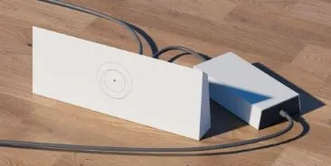
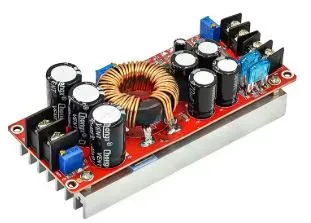
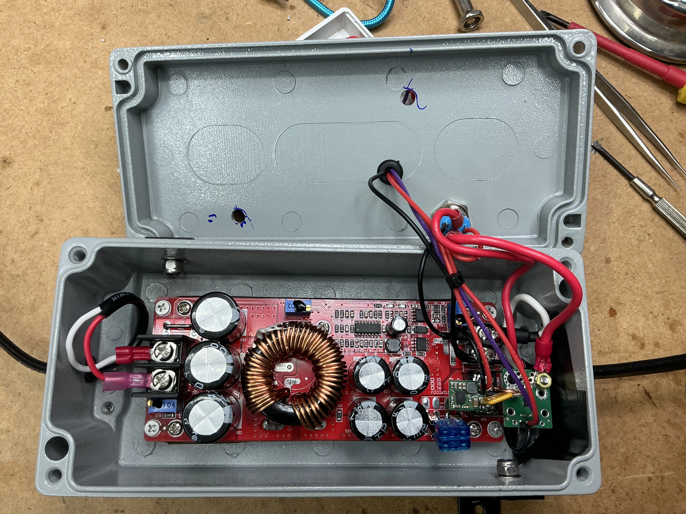
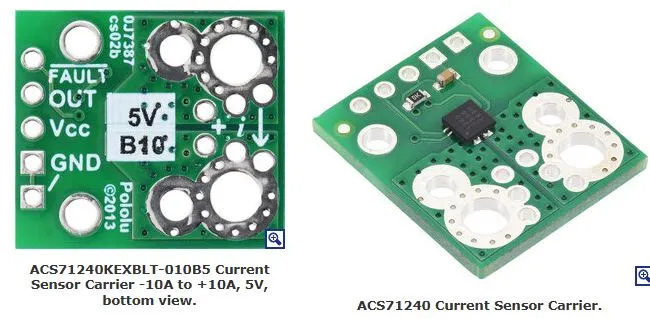
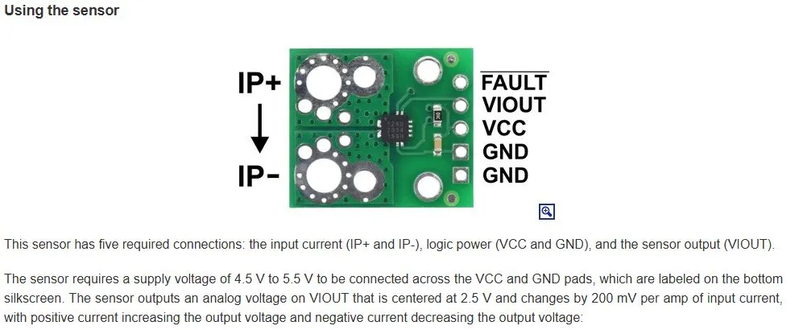
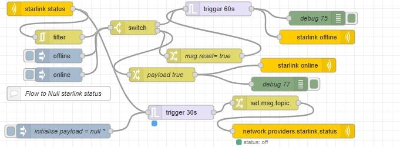
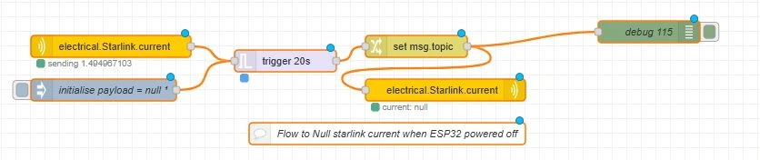
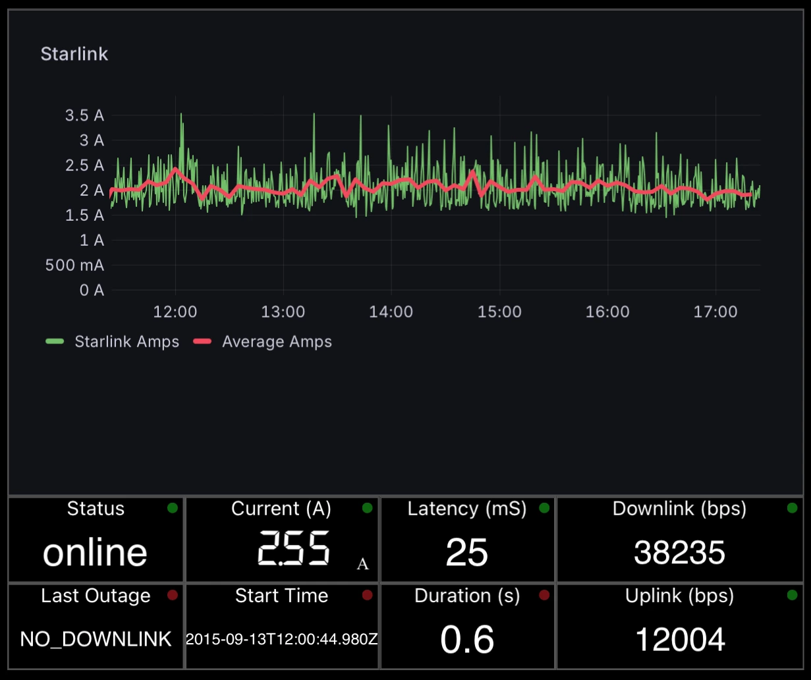
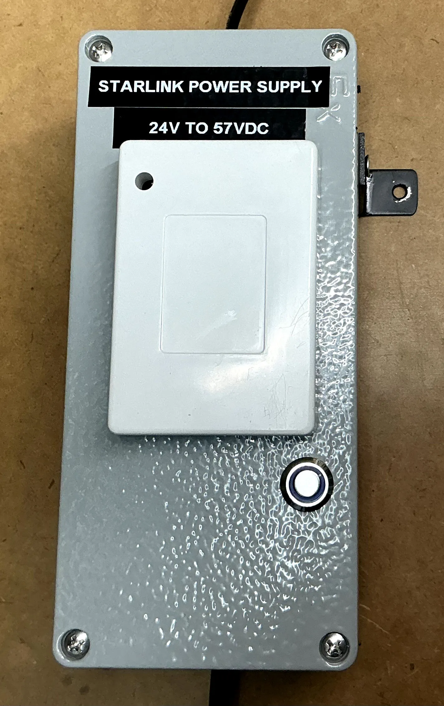

## Background

Like many cruisers, I recently installed Starlink on my boat, in this case a Gen3 unit, however I wanted to eliminate the supplied mains power supply ("brick") and replace it with a DC-DC power supply; monitor its power consumption, along with Starlink operation.
When using the included mains power supply, a multiple conversion process from battery power (DC) through the boat’s onboard Inverter to AC, then a further AC back to DC via the power brick - results in a chain of inefficiency that multiplies.
By eliminating one of these steps, it improves the overall "power supply" efficiency; with Starlink average power consumption around 45W this improvement adds up over a period of time whilst at anchor.

## DC-DC Power Supply

The Starlink Gen3 WiFi/Router has a rather peculiar 57VDC input requirement, that as standard is supplied via mains power brick.

Replacing it with a DC-DC "boost" module, enables powering the router directly from my "24VDC" house system.
Specification of DC Buck convertor:

- input 10-60VDC
- output 12-90VDC adjustable; max 20A; 1200W
- claimed "up to 95% efficiency"

A lower capacity boost convertor could have been used, I just happened to have this in my stock of spares.
The boost convertor is mounted inside a fully shielded metal case (its adjacent to other wifi, bluetooth & zigbee transceivers); so i wanted a level of RF shielding from any RFI. The ESP32 module (inc wifi) is mounted in a plastic box on the outside.

## Measuring Current

A simple "Hall effect" current sensing module (ACS71240 10A) is used to measure current consumption.

## ESP32 with sensESP

The output (VIOUT) of the current sensing module is read by an ESP32 ADC ("analog" A0) input and reported to signalk with sensESP.

## System block diagram

## sensESP

The sensESP framework for ESP32
[SensESP Getting Started](https://signalk.org/SensESP/pages/getting_started/)
is used to read & convert the analog voltage from the current sense module, averaging it and formatting it for periodic updating of the SKpath in signalK.

## Starlink Plugin

The signalk-starlink plugin The signalk-starlink plugin
The signalk-starlink plugin [https://github.com/itemir/signalk-starlink](https://github.com/itemir/signalk-starlink)
reports a number of performance & status parameters, these are automatically created as skpaths by the plugin.

Unfortunately "power consumption" details from the Starlink unit are not available via the plugin, hence why I added a current (A) sensing module.

## Node-Red alerting

The starlink plugin continually updates the signalk path status ("online or offline"), however i only wanted to receive an alert when it went from online to offline (or vice versa).

This flow performs two tasks:

- "filters" the change in status (so it only triggers a notification alert) on a status change.
  The "send notification node" is used to raise a signalK "alert" notification;... so I become aware (before my "crew"" commence complaining!)
- changes the sk status path to "off" if it doesn't receive an update for 30 seconds.
  When power is disconnected to Starlink (eg circuit breaker switched off), the plugin cant update the status, and hence doesn't update the skpath. This ensures the status is set to "off" (& not left in a previous state)

## Node-Red current monitoring

The ESP32/sensESP is powered from the same power supply/circuit, so when power is switched off, sensESP no longer updates the current, leaving the skpath with "old" data.
This flow checks (every 20s) for electrical.Starlink.current updates, and sets the path to "Null" if it hasn't received an update.

## Starlink Monitoring dashboard

Current (Amps) is logged to influx, thus enabling grafana history graphing; which is embedded into a WilhelmSK dashboard display.

## Summary

I was able to eliminate an unnecessary additional power supply "conversions", thereby improving efficiency; and include current sensing to measure power consumption. This compliments the monitoring information available from the signalk-starlink plugin; to provide a comprehensive monitoring dashboard & automated alerts of starlink operation & performance.
