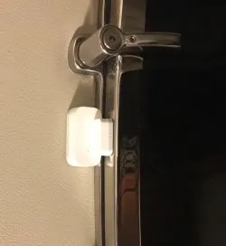
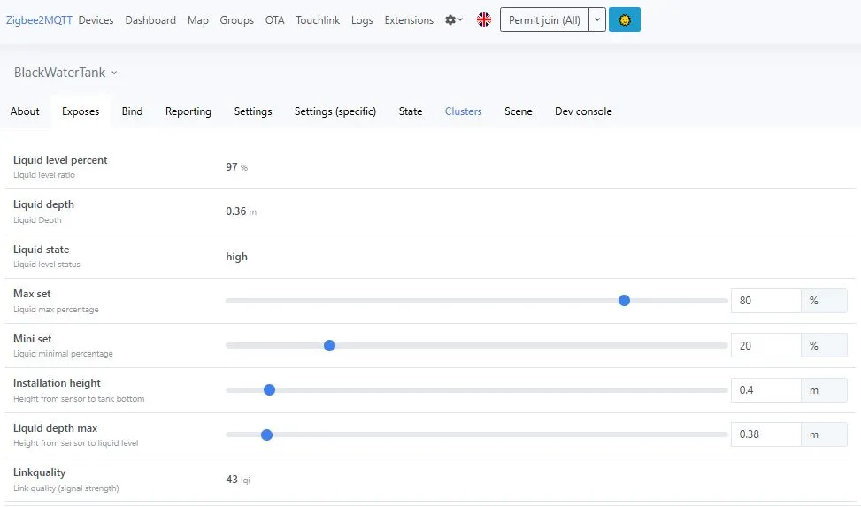
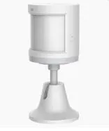
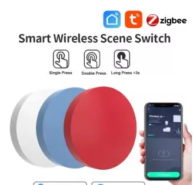
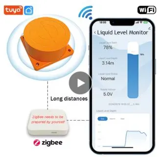
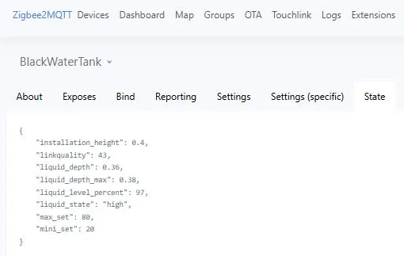
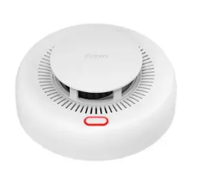
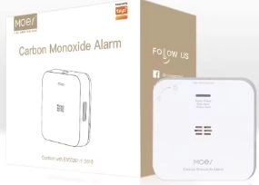
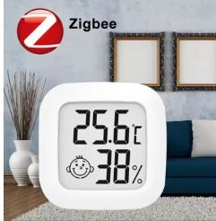
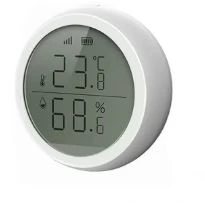

## Background

I wanted to fit door/window sensors to my boat, given that a number of my portholes are close to the waterline, a disaster waiting to happen when visitors are on board & I get underway. I needed wireless sensors that would "stick" onto window/door frames, and have reliable coverage, decent battery life, and be inexpensive.

After initial testing and success, I expanded the range of sensor types and now have 30 Zigbee devices scattered around the boat, including in the engine room and bilge spaces; that have operated reliably for >2 years.

## What is Zigbee?

Zigbee is a low-power wireless protocol for enabling sensors and other devices for home automation & telemetry/control. It operates in the same 2.4 GHz spectrum as Wi‑Fi and Bluetooth; however, it is optimised for low-power battery-operated devices. The rise of Home Automation & IoT has driven extensive availability of low cost Zigbee sensors, that span categories from simple magnetic switch sensors for doors/windows, proximity/motion sensors through to environmental sensors such as smoke, carbon monoxide, temperature, and humidity. These sensors are inexpensive and readily available from a variety of online sources.
I have sensors fitted across my 19m (60ft) Flybridge Motor Yacht, including in the engine room & bilges, with no difficulty in wireless range/quality reception to a centrally mounted "Zigbee USB dongle" connected to the boat's RPi (Signal K server).
Utilising WilhelmSK, I have built dashboards that visually display the status of these sensors; along with Node-RED flows for generation of alarms and alerts.

## Zigbee Sensors

Zigbee sensors are in many cases battery operated, particularly for small devices that have infrequent update intervals, where battery life of 2+ years from small "button" cells is possible.
My initial hatch/porthole "magnetic proximity" sensors simply "stick" with double-sided tape to the frame; and after 2+ years of use have proven reliable, despite my initial reservations of durability. These sensors use a magnet in a small housing, and in my experience even with a "gap" of up to 20mm (3/4") they trigger reliably.

Whilst Bluetooth sensors are also available, their battery life tends to be shorter, and the cost is typically higher, as compared to Zigbee sensors.
After successfully fitting a number of these Zigbee magnetic 'switch' sensors, I further expanded the sensor collection to include:

- Temperature/Humidity
- Carbon Monoxide
- Smoke
- Motion
- Wireless push button switches
- Ultrasonic water level (Black tank)

## Interfacing Zigbee to Signal K Server & Hardware

## Zigbee Coordinator

Zigbee coordinators (ZCs) are the only Zigbee device type that can form (rather than join) a network. In other words, they act as a gateway for Zigbee devices to connect to the RPi/Signal K server.
There are various Zigbee adaptors/gateways available - however for this purpose a simple USB device that just passes the information bidirectionally between the sensors & the RPi will suffice; I have used a "Sonoff Zigbee 3.0 USB ZBdongle-P".

This has the advantage of being powered via its USB connection to the RPi, it features an "external antenna" and by using a simple USB extension cable it can be optimally positioned for reception performance.
The dongle needs to be flashed with "Z-stack coordinator" firmware, if not already supplied with "zstack firmware" from the factory ([see this guide](https://github.com/Koenkk/Z-Stack-firmware/blob/master/coordinator/README.md)).

## Zigbee2MQTT software

This software runs on the RPi providing a "bridge" between Zigbee devices (connected via the "Zigbee coordinator") & an MQTT server running on RPi.

For installing it onto RPi and configuring it, [see this guide](https://www.zigbee2mqtt.io/guide/getting-started/).

## Zigbee Setup

After following the above Zigbee2MQTT guide for installation & configuration, this will then create a "frontend on port 8080" - that provides a web page for adding & configuring Zigbee devices.
(Use your same RPi IP address with :8080 appended, note this can be changed as required)

On the top row - click on "permit join all", this puts the Zigbee stick into "pairing" mode. Then likewise on your sensors, click on the pairing button (or initiate pairing - it depends on Zigbee device). For the Aqara Zigbee window/door sensors, you click the small button on its side. You should see the sensor appear in the list. Give it a "friendly name".

Configure the MQTT "base topic" & the MQTT server details. The sensor should now be sending data to the MQTT server with a JSON payload, which needs to be parsed to extract individual data and populate respective SignalK paths. This is done via a simple Node-RED flow.
Zigbee2mqtt software has an extensive & well supported database of devices, that is regularly updated; it will typically recognise the device and know what data to expect. Using the web interface, each sensor shows the data that it "exposes", and if required enables sensor configuration.
As noted, Zigbee and Wi‑Fi channels both exist in the 2.4 GHz band, occupying the same frequency space. When deploying both Wi‑Fi and Zigbee in the same environment, careful planning must be performed to make sure that they don't interfere with each other.
The Zigbee channel to be used can be set through the web interface; using Ch25 minimises potential interference.

More complex sensors, e.g., Ultrasonic Level Sensors, have JSON payloads with multiple parameters (value pairs) and can also be configured via the web interface.
All Zigbee devices report "battery level" & "link quality", making it convenient to monitor battery life and set reminders, and also troubleshoot poor reception issues.

## Node-RED flow

For any of the Zigbee wireless sensors, each MQTT message includes a JSON payload from the sensor, which typically has a number of properties, requiring the desired values to be extracted & populated into respective SK paths. This is accomplished using a Node-RED flow with an "MQTT IN" node, parsed using a "change" node, followed by a send pathvalue node to populate the SignalK path. For contact sensors that report JSON as "open" or "closed", additional nodes convert this into 1 or 0 path values.
The JSON data for each sensor is shown in the "exposes" tab in the Zigbee2MQTT web page, from which the Node-RED parsing statements ("change" node) can be determined.

Repeat as many times as required, once for each Zigbee sensor.
Note: that if utilising newer SignalK MQTT plugins, this parsing & populating of SK paths from MQTT data might be configurable via the plugin, thereby avoiding the need for Node-RED parsing.

## Display of Hatch/Porthole Status

One of the disadvantages of Zigbee sensors, stemming from their low-power/long battery life characteristics, is they typically only report when a change occurs and/or after a predefined (long) elapsed time period. Accordingly the data becomes "stale" in SignalK, so respective dashboard/display applications need to treat (or ignore) this accordingly. In the dashboard example at top, I'm using WilhelmSK (iOS devices) with a background image (line drawings of the boat) and "LED gauges" placed over the top of the image at locations of hatches etc. The gauge is defined to be transparent when off and red when on (Signal K path = 1).

The magnetic switch sensor only updates when it closes/opens (and at a less frequent rate for battery or other updates); accordingly its freshness of data can be many hours old if you haven't opened/closed the hatch/window.

## Zigbee Motion Sensors

I have fitted motion sensors inside the saloon and also (under cover) in the outdoor cockpit area; despite the harsh environment and water splashing, to date the sensors continue to work very well.
In a similar way, I utilise Node-RED flows to capture motion and then initiate actions, e.g., switching on lights when conditions are met.
Given that with a combination of door/hatch & motion sensors, this provides an excellent basis for an intruder alarm system and/or alerts/notifications when you're away from the boat at anchor or when it's at the dock!

## Zigbee Push Button (tap) switches

It's not always convenient to run a new wire and install a wall switch, but with low-cost ($5 each) "stick-on" Zigbee push buttons, you can conveniently place them around the boat, beside the bed to switch on lights or take other actions (e.g., they even come in red — that could make a perfect MOB button).
Each Zigbee "button" can have three actions, namely "tap", "hold" and "double tap" - accordingly the Node-RED flow can initiate different actions as required.
Switches are available in multi-gang wall plates for those more complex switching tasks.

## Zigbee Ultrasonic Tank Level sensor

My black tank has simple float switches for "empty" (switch off pump out), "warning" (80%) and "full"; however, I wanted improved resolution across the zero-to-full range, and while NMEA 2000 ultrasonic sensors cost >$200 and also need wired connectivity into the N2k backbone (which in my case was very difficult to achieve for this tank location), I found a Zigbee ME210WZ Ultrasonic sensor (12V powered, not battery) that is claimed to "read tank depths up to 4m"; in my case the tank is only 0.4m deep. The sensor has a claimed "dead zone" from 0-100mm; however, in my testing it reads reliably to around 40mm from its mounting face, and certainly with sufficient accuracy to monitor your black tank rate of use!
Not only do you get tank level (ratio) in SignalK, but by utilising the "SignalK to NMEA2000" plugin, the respective N2k PGN can be output for Black tank level, enabling it to be viewed on N2k-capable displays (e.g., MFDs).

## Zigbee Smoke Sensor

This unit operates as a standalone smoke sensor, but with the additional wireless Zigbee functionality, I fitted one of these in the engine room, where it's impossible to hear its inbuilt beeper from my helm position. However, using notifications from SignalK, I can send alerts to my phone and various SignalK display devices (e.g., WilhelmSK dashboards and alerts).
This sensor provides not only an "alarm" payload, but also "smoke density" concentration; albeit I have no way to determine any usable calibration for this.

## Zigbee Carbon Monoxide Sensor

This unit is fitted in the engine room, and provides JSON data with an alarm if CO is detected & CO level in PPM.
For testing purposes, I held the unit near my car exhaust; an alarm was generated (as expected) along with a PPM reading that was within an expected range for my test conditions. Having experienced a bad exhaust leak on a previous boat (what a mess that makes in the engine room!), I'm keen to be able to detect this much earlier, aside from of course the obvious safety aspects of early CO detection.

## Zigbee Temperature/Humidity sensors

There are a range of Zigbee temp/humidity sensors available; some include a display (LCD) whilst others don't, but are smaller.
I have the higher-quality units with larger LCD displays velcro-mounted on cabin walls for local display, in addition to their Zigbee reporting into SignalK.

## Zigbee Hardware/Sensor Costs

At the time of publication (Sep 2025) (US$)

- ZBDongle-P ~$22
- Magnetic proximity switches ~$4
- Motion sensor ~$6
- Ultrasonic Tank Sensor ~$45
- Smoke sensor ~$15
- Carbon Monoxide sensor ~$22
- Temperature/Humidity ~$5-12

## Summary

For a modest investment, a powerful array of wireless sensors can be built utilising Zigbee technology and battery-operated devices that are easily deployed around the boat, and from my experience have proven quite durable and reliable over a 2+ year period.
